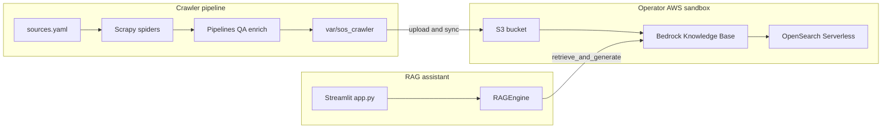

# Architecture

## Overview

This Proof of Concept combines two systems:

1. **Regulatory crawler** (`src/sos_crawler/`) — collects administrative rules from Secretary of State sources across seven states, normalizes metadata, and writes manifests and text artifacts under `var/sos_crawler/`.
2. **RAG assistant** (`src/app.py`, `src/rag_engine.py`) — Streamlit chat UI that queries an Amazon Bedrock Knowledge Base (backed by OpenSearch Serverless) and returns answers with citations.

Mississippi remains the **primary reference state** for citation URLs and indexing conventions. Other states follow the same agency targets (dental, medical licensure, real estate).

## Data flow

## RAG request path

1. User selects **state scope** in the sidebar (checkbox grid; empty selection searches the full knowledge base without a metadata filter).
2. `RAGEngine.query()` calls Bedrock **RetrieveAndGenerate** with:
   - `numberOfResults: 20` (always set so Bedrock does not default to 5).
   - Optional `state` metadata filter when one or more states are selected.
3. The assistant message is rendered with citation expanders; Mississippi rules may link to `sos.ms.gov`, and S3-backed documents may use presigned URLs when configured.

## Crawler components

| Piece | Role |
|-------|------|
| `orchestrator.py` | Runs spiders per state from `config_data/sources.yaml` |
| `pipelines.py` | Agency scope, normalize, save documents, change tracking, manifest |
| `tools/qa.py` | Post-crawl field validation |
| `tools/enrich.py` | Chunk manifests into knowledge-package JSONL for indexing |
| `.github/workflows/crawl.yml` | Scheduled CI crawl (artifacts only; not committed to git) |

## Deployment context

- **Streamlit UI**: local or Streamlit Cloud; requires AWS credentials and Bedrock KB access.
- **Crawler**: local, distrobox with Playwright, or Docker image (`Dockerfile`).
- **Lambda**: `lambda_handler.py` uses `/tmp` for crawler runtime when `AWS_LAMBDA_FUNCTION_NAME` is set.

This repository does **not** include production infrastructure-as-code for Bedrock or OpenSearch; operators supply their own sandbox accounts and indexing workflow.
